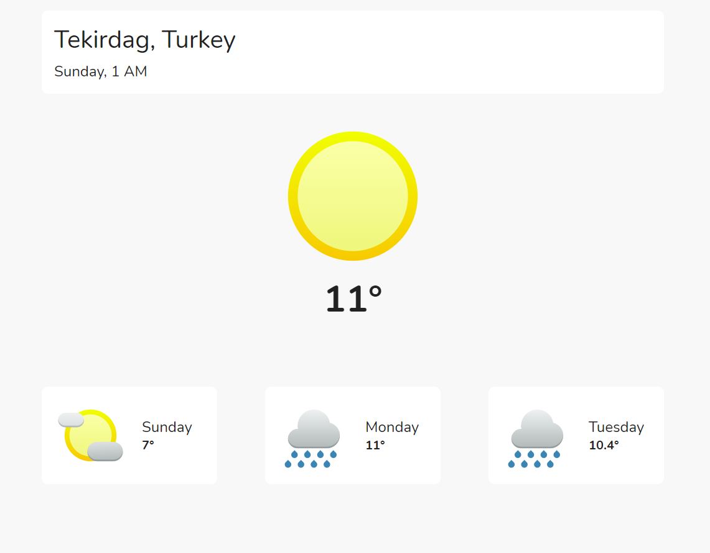
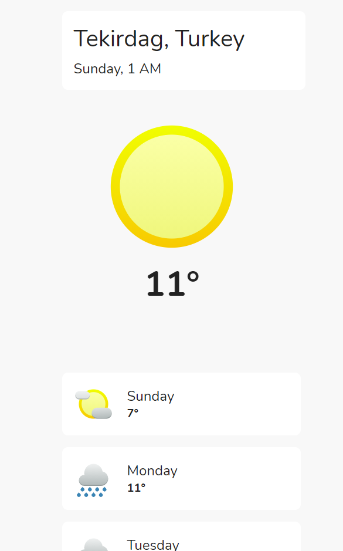

# React Weather App using Weather API (weatherapi.com)

You need to get yourself API key from [weatherapi.com](https://weatherapi.com) and paste is inside Home.tsx

When you make it just type `yarn start` and hit enter.

Screenshots:

